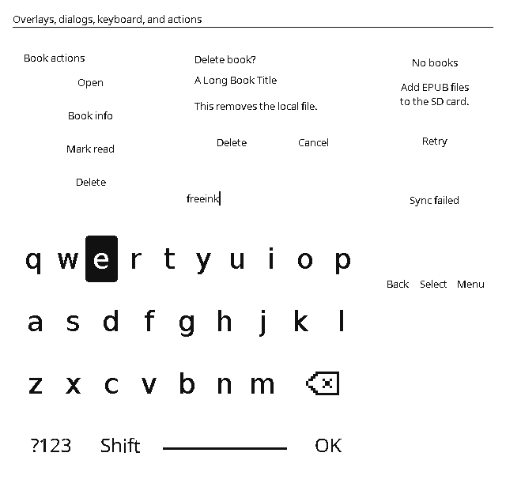
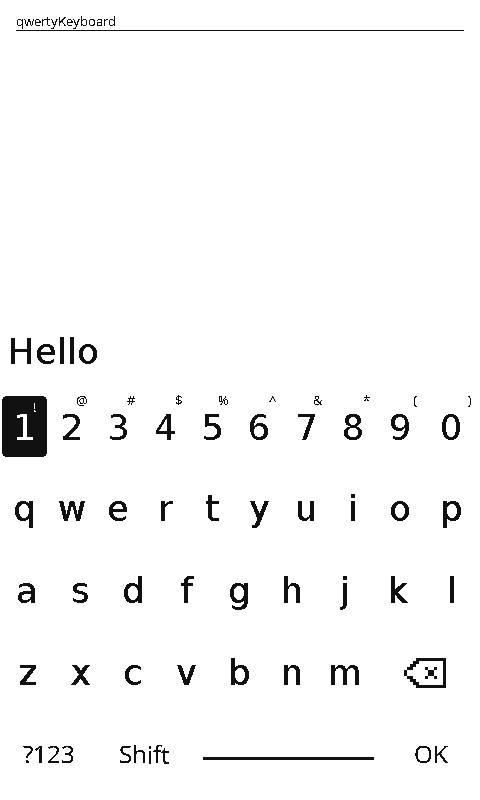

# FreeInk SDK

[](https://opencollective.com/freeink)

A hardware-independent SDK for building e-paper reader firmware. FreeInk
abstracts every device-specific detail — display controller, waveforms/LUTs,
GPIOs, bus speeds, input style, touch, frontlight, audio — behind small,
injectable interfaces, so the firmware calls one generic API and gets
device-specific behavior. Adding a new device means adding data (a board
profile + a driver config), not editing the generic code.

It is **drop-in compatible** with firmware written against the original
`EInkDisplay` / `InputManager` / `BatteryMonitor` / `SDCardManager` / `BoardConfig`
API: switching to FreeInk is a matter of repointing the library path.

Start with [PlatformIO integration](#using-freeink-from-platformio), browse the
[documentation index](docs/README.md), or run the [host tests](docs/testing.md).

## What's included

- **Display facade and panel drivers** for SSD1677, UC8179, UC8253, UC8279,
  ED2208, IT8951, and external-library-backed panels.
- **Board profiles and capability gates** for display, input, touch, SD,
  frontlight, audio, microphone, RTC, sensors, buzzer, LEDs, and TLS networking.
- **Device managers** that keep firmware code stable across different boards:
  input, battery, SD, frontlight, LEDs, audio, microphone, RTC, sensors, and IMU.
- **FreeInkUI**, an optional immediate-mode UI layer for e-paper reader screens,
  dialogs, settings, keyboards, library views, and future GUI-builder previews.
- **FreeInkBook**, a complete EPUB reading engine — streaming parse, CSS,
  UAX #14 layout with hyphenation/justification/ligatures, page caching with
  exact position anchors, TTF fonts with per-codepoint fallback, image
  dithering, links/footnotes — freestanding, arena-allocated, host-tested
  (see [docs/freeink-book.md](docs/freeink-book.md)).
- **Icon and asset tooling** for crisp 1-bpp Lucide-derived icons and generated
  C/C++ assets.

## Credit & lineage

FreeInk is an MIT-licensed **re-architecture derived from** the
**OpenX4 E-Paper Community SDK** (`open-x4-epaper/community-sdk`, MIT) and its
contributors — in particular **CidVonHighwind** for the original `EInkDisplay`
driver and the X3/X4 waveform work, and the community device ports (M5Stack
PaperColor, Murphy M3, and the `community-sdk-de-link` ESP32-S3 port). The
register sequences and waveform LUTs for the SSD1677 and UC8253 panels are
**derived from** that project — i.e. carried over and adapted, not
reverse-engineered independently — so the community's panel tuning is preserved.
Attribution is in `NOTICE`. Huge thanks to everyone who reverse-engineered and
tuned those panels.

See [display driver reference coverage](docs/display-driver-references.md) for
the source hierarchy and the limits of matching GxEPD2 implementations.

What FreeInk changes is the **structure**, not the panel work: where the upstream
interleaves every device in one monolithic driver, FreeInk splits each controller
into a standalone, compile-time-selectable driver behind a stable facade, with
per-device behavior supplied as injectable config. It is **not a fork** and has no
build-time or runtime dependency on the upstream repository — its own history and
architecture — but the inherited waveforms are the upstream's, and the
re-architecture itself is comparatively new code that has had less multi-person
field testing than the upstream.

> License note: this repository is distributed under the **MIT License** (see
> `LICENSE`) — the same permissive, open-source terms as the upstream. Portions
> are derived from MIT-licensed upstream code; that attribution is preserved in
> `NOTICE`.

## Architecture

```
firmware  ─calls─▶  EInkDisplay  (alias of freeink::FreeInkDisplay, the facade)
                          │ owns framebuffer + geometry, selects a driver at begin()
                          ▼
                    PanelDriver  (interface)
              ┌───────────┼───────────────┬───────────────┐
        Ssd1677Driver  Uc8253X3Driver  Ed2208M5Driver  Uc8253MurphyDriver
         (X4/de-link)     (X3)            (M5)            (Murphy)
                          │  native controllers share
                          ▼
                       EpdBus  (SPI/GPIO framing, BUSY polarity, reset, mirror)

  External-bus drivers (M5OfficialDriver, LgfxEpdDriver/LilyGo, It8951Driver/M5Paper)
  own their own bus and report usesExternalBus(), so the facade leaves EpdBus down.
```

- **`FreeInkDisplay`** (facade, exposed as `EInkDisplay`) owns the framebuffer(s)
  and geometry and delegates every panel operation to a `PanelDriver`. It
  preserves the full public API, including the `FULL_REFRESH` / `HALF_REFRESH` /
  `FAST_REFRESH` modes and the grayscale / anti-aliased dual-plane path
  (`copyGrayscaleBuffers` → `displayGrayBuffer`, `writeGrayscalePlaneStrip`).
- **`PanelDriver`** — one implementation per controller, in its own file. Each
  driver owns its register sequences and cross-call state, and takes its
  waveforms/LUTs/tunables as an injected **config** (e.g. `Ssd1677Config`,
  `Uc8253X3Config`) so per-device tuning is data, not code.
- **`EpdBus`** — shared SPI/GPIO helper, parameterized by SPI clock and BUSY
  polarity (per-controller default, board-overridable via
  `BoardConfig::ACTIVE.displaySpiHz`).
- **`BoardConfig`** — the one compile-time-selected description of a device:
  pins, geometry, controller, input style, touch, frontlight, audio, power
  latches. Boot helpers keep board bring-up out of app code:
  `BoardConfig::holdPowerRails()` asserts the profile's power-latch pins
  (battery-latched boards power off without it), and
  `BoardConfig::releaseSdRail()` rescues an SD rail a previous firmware's
  sleep left gpio-held off — required before first display use on boards
  where SD shares the display SPI bus (`SDCardManager::begin()` does it
  itself).

### Nothing device-specific is hardcoded in generic code

Display GPIOs come from `BoardConfig::ACTIVE.display` at `begin()`, after any
runtime board selection. The `EInkDisplay` constructor retains its pin arguments
for source compatibility, but does not use them to configure the bus. Other
peripheral GPIOs also come from `BoardConfig`. SPI clocks have a
controller default and a board override. Waveforms/LUTs, booster values, scan
direction, and refresh temperatures are injected via the driver config struct. A
new device fills in values; the generic driver consumes them.

Device *names* and `FREEINK_DEVICE_*` flags live **only** in `BoardConfig` (the
registry), which derives `FREEINK_DRIVER_*` / `FREEINK_CAP_*` from them. Feature
files — facade, drivers, input, SD — key only off those derived flags and injected
config/hooks, never a device name. Board quirks that aren't plain config (e.g. an
SD rail behind an I²C PMIC) come in through hooks like `SDCardManager::setPowerHook()`,
so the SD manager itself stays device-agnostic.

## Supported devices

| Device | MCU | Controller | Panel | FreeInk support |
|---|---|---|---|---|
| **Xteink X4** | ESP32-C3 | SSD1677 | 800×480 | B/W + 4-level grayscale |
| **Xteink X3** | ESP32-C3 | UC8253 | 792×528 | B/W + 4-level grayscale; BQ27220 I²C battery gauge; shares the C3 binary with X4 |
| **OnePage** | ESP32-C61 | SSD1677 | 800×480 | B/W + 4-level grayscale, 4-key front resistor ADC ladder + 3 side keys, shared SPI MicroSD with power gating, Wi-Fi 6 + BLE 5.4 wireless page-turner remote host |
| **de-link** | ESP32-S3 | SSD1677 | 800×480 | B/W + grayscale, PWM frontlight, native 4-bit SDMMC SD |
| **M5Stack PaperColor** | ESP32-S3 | ED2208 | 400×600 Spectra-6 color | native interrupted-refresh driver, optional M5GFX backend, built-in speaker (ES8311 codec + AW8737A amp), 2x RGB LEDs |
| **Murphy M3** | ESP32-S3 | UC8253 | 240×416 | B/W (90°-rotated framebuffer, full/fast LUTs), CHSC6x touch, PWM frontlight |
| **LilyGo T5 S3** | ESP32-S3 | ED047TC1 (raw parallel) | 960×540 16-gray | LovyanGFX EPD driver with 16-gray, GT911 touch, PWM backlight, BQ27220/BQ25896 I²C battery |
| **M5Paper v1.1** | ESP32 (classic) | IT8951E | 540×960 16-gray ED047TC1 | hand-rolled IT8951 driver (own SPI, 1bpp→4bpp load, GC16/DU/A2 modes, auto rotation onto the portrait panel), GT911 touch, GPIO35 ADC battery |
| **Sticky** (Upcoming Device) | ESP32-S3 | SSD1677 | 3.97" 800×480 B/W | reuses the SSD1677 driver (X4-class), GT911 touch, PDM microphone (Microphone lib), BQ27220 I²C battery gauge, PCF8563 RTC + SHT40 temp/humidity + LSM6DS3TR-C IMU (Rtc / EnvironmentSensor / Imu libs), SPI MicroSD (shares the display bus), LEDC buzzer (Buzzer lib); orientation/SD-sharing pending hardware validation |
| **Xteink X4 Pro** | ESP32-S3 | SSD1677, UC8179, **or UC8279** (per batch) | 800×480 B/W | GT911 touch, dual warm/cold frontlight, native 1-bit SDMMC, BM8563 RTC, CW2017 battery gauge; controller auto-detected at boot |
| **Xteink X4 Classic** (X4C) | ESP32-S3 | SSD1677, UC8179, **or UC8279** (per unit) | 800×480 B/W | same board/glass as the X4 Pro but **no touch, no frontlight** — those pins become four extra discrete front buttons (8 buttons total); native 1-bit SDMMC, BM8563 RTC, CW2017 battery gauge; controller auto-detected at boot |
| **M5Stack Paper Mono** | ESP32-S3 | SSD1677 | 800×480 B/W | non-flashing fast refresh + 3-level grayscale (host-authored LUTs), FT6336 touch, PMIC-PWM frontlight (AW9967), RX8130 RTC, PDM microphone, LEDC buzzer, discrete RGB LED, native 1-bit SDMMC, M5PM1 battery/charging telemetry; power/reset rails sequenced through the on-board M5PM1 PMIC + M5IOE1 expander |
| **Waveshare ESP32-S3-ePaper-3.97** | ESP32-S3 | SSD1677 | 3.97" 800×480 B/W | reuses the SSD1677 driver with the Sticky's vendor sequences, 3 side keys + BOOT (no touch), native 4-bit SDMMC, AXP2101 PMIC as EPD rail + battery gauge + power key, PCF85063 RTC, QMI8658 IMU; orientation pending hardware validation — see docs/waveshare-epaper-397-support.md |
| **M5Stack PaperS3** | ESP32-S3 | ED047TC1 (raw parallel) | 960×540 16-gray | same LovyanGFX EPD driver class as the LilyGo T5 S3 (plain-GPIO EPD rails, no PMIC), GT911 touch (touch-only navigation — no GPIO buttons), BM8563 RTC, GPIO3 ADC battery, LEDC buzzer, SPI MicroSD; power-off is a GPIO44 pulse to the PMS150G latch (`BoardPaperS3::powerOff()`); rotation/touch-flip pending hardware validation |

X3 and X4 share the ESP32-C3 and a pinout, so **one firmware binary drives both**:
it carries both board profiles (`XTEINK_X4` and `XTEINK_X3`) and picks one at
runtime via `setDisplayX3()`, which swaps the active profile and driver. The
`XteinkDetect` library (`libs/hardware/XteinkDetect`) supplies the canonical
detection: `freeink::selectXteinkDevice()` runs an I²C fingerprint of the
X3-only peripherals (BQ27220 gauge, DS3231 RTC, QMI8658 IMU on SDA20/SCL0),
calls `BoardConfig::selectDevice()` for the match, and returns whether an X3 was
found so the caller can `display.setDisplayX3()`. Call it before
`SDCardManager::begin()` and `FreeInkDisplay::begin()` so both read the right
profile. In builds without an Xteink profile the helpers compile to no-ops that
return false without touching any pins, so an unconditional call is safe on
every device. Devices on a different MCU build their own binary, selected with a
`-DFREEINK_DEVICE_*` flag. A build targets exactly one of the four MCU families — ESP32-C3 (X3/X4),
ESP32-C61 (OnePage), ESP32-S3 (de-link/PaperColor/Murphy/LilyGo/Sticky/X4 Pro/Paper Mono/PaperS3/Waveshare 3.97), or classic ESP32 (M5Paper);
`BoardConfig` rejects mixing families at compile time.

#### Per-batch panel controllers (`applyXteinkDisplayController()`)

Several Xteink panels ship a **different display controller depending on the
production batch**, on the same board and pinout: the X3 moved from **UC8253** to
**UC8279d**, while X4-family units may carry **SSD1677**, **UC8179**, or
**UC8279**. A binary hardcoded to one controller shows a blank screen on another
batch. `XteinkDetect` resolves which silicon a unit carries at boot:

```cpp
#include <XteinkDetect.h>

// Detect and apply the display controller for this unit's batch:
freeink::applyXteinkDisplayController();
display.begin();
```

Resolution order:

1. **OEM factory value in NVS** — namespace `hw_calib`, key `screenType` (u8:
   `1`/`0x0B` = UC8179, `2`/`0x0C` = UC8279, else the shipping SSD-family / UC8253
   part). The factory writes it once and never rewrites it, so it survives a
   reflash and is authoritative; the bus probe is then skipped entirely.
2. **Display-bus probe** (`detectXteinkDisplayController()`) — only when NVS has no
   value (erased/absent). It bit-bangs a half-duplex read of the UC81xx **VER
   (`0x70`)** / **FLG (`0x71`)** registers on the active display pins; the
   SSD-family and UC8253 don't answer `0x70` the same way, so a matching signature
   in two agreeing passes confirms the UltraChip sibling. It reads pins from
   `BoardConfig::ACTIVE`, so it is safe on the S3 (unlike the C3-only I²C
   fingerprint above). It can't false-positive a working SSD1677 unit (that bus
   floats to `0xFF`), so a wrong guess only ever leaves the shipping controller.

`detectXteinkDisplayController(verBytes, flg)` exposes the raw probe bytes and a
verdict for bring-up logging; `applyXteinkDisplayController()` is the one-call
convenience most consumers want. Both are no-ops on non-Xteink builds.

Every SDK library compiles on ESP32-C3, ESP32-S3, and the classic ESP32.
Chip-specific code in a consumer's *own* layer (deep-sleep wakeup, panic
backtrace, flash pins) can block a multi-MCU build;
[`docs/consumer-mcu-portability.md`](docs/consumer-mcu-portability.md) covers the
changes a consumer makes.

### M5Stack PaperColor refresh behavior

The PaperColor is natively a **six-color (Spectra 6), full-refresh** panel: a
complete OTP waveform takes **~15 s** — unusable for reading. To get
reading-compatible speeds, FreeInk's native driver **interrupts the refresh at
~340 ms**. The colors settle in order with **white settling last**, so cutting
off early leaves the panel **black or yellow** (depending on the inversion /
polarity selected) rather than white — and FreeInk exploits that to produce a
fast, high-contrast monochrome image. A true white background / full color
requires running the complete waveform (`requestCompleteWaveformNextRefresh()`).

> **DC balance — schedule periodic complete waveforms.** E-paper waveforms are
> DC-balanced only when they run to completion; the interrupted path leaves a
> small net charge on every pixel per refresh. That charge accumulates: over
> hours of interrupted-only operation the panel visibly darkens and color
> intensity fades (the driver's every-6th-refresh full-panel pass is also
> interrupted, so it does not help — it clears geometric ghosting, not charge).
> Consumers must periodically promote a refresh to the complete waveform via
> `requestCompleteWaveformNextRefresh()` — roughly hourly works well — timed
> around their own UX, since the complete waveform blocks for ~15 s.

Two additional facades suit **standing-image consumers** (clocks, dashboards —
anything whose screens park rather than page):

- `setFullRefreshCompletesWaveform(true)` makes every `FULL_REFRESH` run the
  complete OTP waveform, so each standing image is a clean, DC-balanced,
  truthful render without threading the one-shot request through every call
  site. `HALF`/`FAST` stay interrupted for transient frames (dialogs, alarms,
  key feedback). Off by default — readers keep the fast `FULL`.
- `setAccentPlaneSlot(slot, plane, colorCode)` takes host-owned 1-bit overlays
  with the framebuffer's geometry (up to 4 slots, one color each; the lowest
  slot with a set bit wins on overlap): set bits recolor that pixel's **ink**
  to a Spectra-6 color (`FreeInkDisplay::SPECTRA_RED` etc.) on
  complete-waveform refreshes. Interrupted refreshes ignore the planes —
  pigments never settle in a cut-off waveform — so accents appear exactly on
  the standing images that can render them.

Two backends are selectable for this device:
- **Native ED2208 (default)** — the fast interrupted-refresh path above.
- **M5 official (`-DFREEINK_M5_OFFICIAL=1`)** — wraps M5's own **M5Unified + M5GFX**
  stack for users who prefer the vendor path (slower, but standard). This pulls
  the M5 libraries only on that env; M5GFX owns the bus (`usesExternalBus()`).

PaperColor's two RGB LEDs are exposed through `LedManager`. The board profile
sets GPIO21, two GRB LEDs, and the M5PM1 RGB LED power rail, matching M5's
published PaperColor pin map and LED-class convention. `LedManager` does not
depend on M5Unified; it provides direct color/brightness/flashing control:

```cpp
LedManager leds;
leds.begin();
leds.setBrightness(64);
leds.setAll(LedColor::blue());
leds.flash(LedColor::green(), 3);

void loop() {
  leds.update();  // advances non-blocking flashes
}
```

### M5Stack Paper Mono board support

The Paper Mono routes most of its power and reset plumbing through two PY32
helper chips on the system I²C bus instead of ESP GPIOs: the **M5PM1 PMIC**
(battery telemetry, charging, power button, frontlight PWM, red LED leg) and the
**M5IOE1 I/O expander** (EPD power + reset, touch power + reset, TF-card rail,
PDM-mic rail, green/blue LED legs). The SDK sequences all of it itself —
`PaperMonoBoard.h` is the single owner of the bring-up, and the hardware
managers call into it as needed (`EpdBus` for the EPD rail/reset, `InputManager`
for the touch rail and the PMIC power button, `LedManager` /
`FrontlightManager` via their configs) — so consumer firmware normally never
touches the PMIC or expander directly. The one exception is the PDM microphone
rail: a consumer that captures audio raises `m5ioe1::PIN_MIC_POWER` in its own
bring-up before recording.

Notable behaviors on this board:

- **Refresh model.** Binary UI paints use the Paper Mono SSD1677's internal non-flashing
  waveform; grayscale paints run host-authored LUTs whose 3-level target is
  batched in host RAM before the waveform starts. The facade's
  `displayCommitted()` / `runMaintenance()` / `controllerIdle()` hooks let
  firmware distinguish a frame that actually reached the panel from one that was
  superseded, and schedule the panel's non-flashing ghost-cleanup pass.
- **Input.** Two physical buttons (`DigitalTwoButton` input style): short
  presses page up/down, holds synthesize back/confirm, and the power button
  arrives as ordinary `BTN_POWER` events polled from the PMIC (its single-click
  hardware reset is disabled at boot; its long-hold download escape stays).
- **Frontlight.** The PWM lives in the PMIC (12-bit, driving an AW9967 boost
  LED driver fed from the EPD rail), so the light only runs while EPD power is
  on. `FrontlightManager`'s normal API applies unchanged.
- **Framebuffer.** `FREEINK_FB_PSRAM` defaults on — the grayscale target planes
  are batched in host RAM alongside the framebuffer, so the build needs
  `-DBOARD_HAS_PSRAM`.

**Capacitive touch** (gated by `FREEINK_CAP_TOUCH`) covers three controllers:
**CHSC6x** (Murphy M3 — IRQ-driven), **GT911** (LilyGo T5 S3 and M5Paper v1.1 —
polled, raw register reads + the reset/address dance, including the capacitive home
key), and the **FT5x06 family** (Paper Mono's FT6336 — polled point reads gated on
the active-low IRQ line). The InputManager exposes `hasTouch/isTouchPressed/wasTouchPressed/
wasTouchReleased/getTouchPoint`; it delivers coordinates raw-panel-oriented and the
app owns display-orientation mapping. GT911 additionally provides allocation-free
multi-contact snapshots, completed 2-4 finger translation gestures, and completed
two-finger rotations with a signed angle, center, and duration. The GT911 boards set
### OnePage Reader board support (ESP32-C61)

The OnePage Reader is an open-hardware DIY e-reader built around the **ESP32-C61**
RISC-V wireless SoC. Complete hardware specifications, pinout, power gating, and
board profile details are documented in [docs/onepage-c61-support.md](docs/onepage-c61-support.md).

Key characteristics:
- **Display**: SSD1677 800×480 on SPI @ 20MHz.
- **MicroSD**: SPI mode sharing the bus with EPD, powered via GPIO27 power rail.
- **Input**: 4-key front resistor ADC ladder on GPIO4 (`OnePageAdcLadder`) + 3 discrete active-low side keys (`UP=6, DOWN=9, POWER=2`).
- **Battery / Power**: ADC sampling on GPIO5 with charge-pause control on GPIO10 (`BAT_CHG_EN`).
- **Bluetooth**: Wi-Fi 6 + BLE 5.4 with BLE HID Central / page-turner remote host support.

## Build composition — devices × capabilities

A build is composed along two axes.

**Devices** (`-DFREEINK_DEVICE_<NAME>`) declare which hardware the binary supports.
Each device pulls in its panel driver, adds its board profile to the runtime
registry, and turns on its default capabilities. Compose any set that shares an
MCU (a C3-vs-S3 mix is a compile error):

| Pass | Result |
|---|---|
| `-DFREEINK_DEVICE_X4` | X4 only — links just SSD1677 (tightest) |
| `-DFREEINK_DEVICE_X3 -DFREEINK_DEVICE_X4` | X3 **and** X4 in one C3 binary, runtime-selected via `setDisplayX3()` |
| `-DFREEINK_DEVICE_ONEPAGE` | OnePage (C61, SSD1677 800×480 + 4-key ADC ladder + 3 side keys + shared SD) |
| `-DFREEINK_DEVICE_DELINK` | de-link (S3, SSD1677 + frontlight) |
| `-DFREEINK_DEVICE_M5` | M5 PaperColor (S3, ED2208 + color) |
| `-DFREEINK_DEVICE_MURPHY` | Murphy M3 (S3, UC8253 + touch + frontlight) |
| `-DFREEINK_DEVICE_LILYGO` | LilyGo T5 S3 (S3, ED047TC1 raw-parallel EPD via LovyanGFX) |
| `-DFREEINK_DEVICE_STICKY` | Sticky (S3, SSD1677 800×480 + GT911 touch + PDM mic) |
| `-DFREEINK_DEVICE_X4PRO` | Xteink X4 Pro (S3, SSD1677/UC8179/UC8279 auto-detect + GT911 touch + SDMMC) |
| `-DFREEINK_DEVICE_X4CLASSIC` | Xteink X4 Classic / X4C (S3, SSD1677/UC8179/UC8279 auto-detect, buttons-only — no touch/frontlight, + SDMMC) |
| `-DFREEINK_DEVICE_PAPERMONO` | M5Stack Paper Mono (S3, SSD1677 + FT6336 touch + PMIC frontlight) |
| `-DFREEINK_DEVICE_PAPERS3` | M5Stack PaperS3 (S3, ED047TC1 raw-parallel EPD via LovyanGFX + GT911 touch) |
| *(none)* | **compile error** — a build must select at least one device |

Multiple **different-pinout** devices on one MCU are runtime-selected: `ACTIVE`
defaults to a compile-time default and the consumer calls
`BoardConfig::selectDevice(...)` after its own detection (the SDK doesn't ship a
detector; X3/X4 detection stays in the consumer, e.g. CrossPoint's fingerprint).

**Capabilities** (`-DFREEINK_CAP_<NAME>`) gate feature *code* to keep binaries
tight. Each defaults on when an included device needs it; force with `=0`/`=1`:

| Flag | Gates | Default |
|---|---|---|
| `FREEINK_CAP_TOUCH` | capacitive touch decoder (InputManager) | on if a device has touch |
| `FREEINK_CAP_FRONTLIGHT` | PWM frontlight (FrontlightManager) | on if a device has a frontlight |
| `FREEINK_CAP_COLOR` | color panel code | on for M5 |
| `FREEINK_CAP_AUDIO` | audio output (AudioManager: ES8388/ES8311 codec + I2S WAV playback) | on for Murphy and M5 |
| `FREEINK_CAP_MIC` | microphone capture (Microphone lib: PDM mic → 16-bit PCM via i2s_pdm RX) | on for Sticky and Paper Mono |
| `FREEINK_CAP_RTC` | real-time clock (Rtc lib: PCF8563 / DS3231 / RX8130 over I²C, per profile) | on for X3, Sticky, X4 Pro, X4 Classic, and Paper Mono |
| `FREEINK_CAP_TEMP_HUMIDITY` | temperature + humidity (EnvironmentSensor lib: SHT40 over I²C) | on for Sticky |
| `FREEINK_CAP_IMU` | 6-axis IMU (Imu lib: LSM6DS3TR-C over I²C) | on for Sticky |
| `FREEINK_CAP_BUZZER` | LEDC PWM tone buzzer (Buzzer lib: tone/beep on `audio.buzzer`) | on for Sticky, Murphy, and Paper Mono |
| `FREEINK_CAP_LED` | RGB LEDs (LedManager: addressable chains, or the Paper Mono's discrete PMIC/expander-driven LED) | on for M5 and Paper Mono |
| `FREEINK_CAP_NET_TLS13` | wolfSSL TLS 1.3 (≡ `FREEINK_NET_WOLFSSL`) | off |

**Other flags:**

| Flag | Effect |
|---|---|
| `-DFREEINK_DISPLAY_FLIPPED` (or `-DFLIPPED`) | back-compat alias for `BoardProfile.orientation = MIRROR_Y` on SSD1677 |
| `-DFREEINK_SD_SDMMC=1` | use the native SDMMC backend — 4-bit or 1-bit per profile (needs `-DUSE_BLOCK_DEVICE_INTERFACE=1`); auto-on for de-link, X4 Pro, X4 Classic, and Paper Mono |
| `-DFREEINK_BATTERY_I2C_GAUGE=1` | compile the I²C fuel-gauge backend (BQ27220/BQ25896); auto-on for X3, LilyGo, and Sticky. Gauge-vs-ADC is then runtime per profile, so X3 (gauge) + X4 (ADC) coexist in one binary |
| `-DEINK_DISPLAY_SINGLE_BUFFER_MODE=1` | single framebuffer (uses controller RAM as previous frame) |
| `-DFREEINK_FB_PSRAM=1` | place the facade framebuffer(s) in PSRAM heap (`MALLOC_CAP_SPIRAM`, allocated in `begin()`) instead of static DRAM `.bss`; auto-on for M5Paper and Paper Mono, off everywhere else |
| `-DFREEINK_NET_WOLFSSL=1` | enable the wolfSSL TLS 1.3 transport in `SecureNet` |

Panel **orientation/mirroring** is per-board data, not a flag: set `BoardProfile.orientation`
(`NO_FLIP`, `MIRROR_X`, `MIRROR_Y`, or `ROTATE_180`). The SSD1677 driver applies it in
hardware (mirrorX via RAM column addressing, mirrorY via gate scan). 90° and 270°
need a software transpose, which the driver does not do.

### Framebuffer placement (`FREEINK_FB_PSRAM`)

The facade's framebuffer(s) sit in static DRAM `.bss` by default — fastest, and the
panel sizes fit comfortably on the C3/S3 parts (the largest, 960×540, is ~63 KB).
M5Paper v1.1 is the exception: the classic ESP32 shares ~300 KB of DRAM with the
IDF/WiFi stacks and the firmware's own buffers, so that 63 KB framebuffer in `.bss`
overflows internal RAM. For M5Paper (and the Paper Mono, whose display driver
additionally batches full grayscale target planes in host RAM),
`FREEINK_FB_PSRAM` defaults on and the framebuffer is heap-allocated in PSRAM (`heap_caps_malloc(MALLOC_CAP_SPIRAM)`, once,
in `begin()`, with a DRAM `malloc` fallback). DRAM is faster than cache-backed PSRAM
and the framebuffer is touched heavily during composition, so it stays off for every
other device — but any DRAM-tight build (e.g. a feature-heavy LilyGo T5 S3, same
63 KB) can opt in with `-DFREEINK_FB_PSRAM=1` without code changes. The build needs
PSRAM enabled (`-DBOARD_HAS_PSRAM`).

## Networking — TLS 1.3 (`SecureNet`)

The precompiled mbedTLS in the ESP-IDF/pioarduino package ships TLS 1.3 as empty
stubs, so `WiFiClientSecure` / `esp_http_client` cannot reach TLS-1.3-only servers
(e.g. KOSync at `kosync.ak-team.com:3042` — handshake fails with `-0x7780`). A
`-D` flag can't change a precompiled `.a`, and a from-source ESP-IDF rebuild is a
heavier path. `SecureNet` brings its own TLS stack — **wolfSSL compiled from
source** — which supports TLS 1.3 + PSA and bypasses system mbedTLS entirely:

- `freeink::SecureClient` — an Arduino `Client` doing TLS 1.3 over `WiFiClient`.
- `freeink::SecureHttpClient` — an `HTTPClient`-compatible shim so existing call
  sites switch with minimal churn.

Opt-in: `-DFREEINK_NET_WOLFSSL=1` plus a wolfSSL source `lib_dep`. With the flag
off it compiles to an inert no-op, so the rest of the SDK builds without wolfSSL.

## UI framework (`FreeInkUI`)

`libs/ui/FreeInkUI` is a memory-bounded, immediate-mode UI layer for e-paper:

- fixed row/column layout slots plus a dynamic flex row/column/tree layout
  primitive (`FreeInkUILayout.h`) for data-driven scaffolds, and semantic
  action routing — touch, GPIO, focus navigation, and gestures all resolve to
  app-defined action IDs
- state-aware styling (`StyleSet` per interaction state) with rounded and
  per-corner-rounded fills, pill selections, dithers, and one-call whole-UI
  inversion for dark mode (`InvertedDrawTarget`)
- virtualized lists (only visible rows are laid out and hit-tested), pill tab
  bars, keyboard grids with glyph art, dialogs, status bars with
  measured-cluster layouts that double as page overlays, metric cards, bar
  charts, and battery glyphs
- borrowed localized strings and host-resolved assets — no heap allocation,
  no file IO, no JSON in the UI layer
- freestanding C++17 with no Arduino dependency, covered by host-side unit
  tests (`libs/ui/FreeInkUI/test/host/run.sh`)

It renders through `DisplayTarget` (`FreeInkUIDisplayTarget.h`), a self-contained
target that draws into `FreeInkDisplay`'s framebuffer with no external graphics
library and bundles a Noto Sans bitmap font — swap in your own with
`tools/gen_font.py`. Optional header-only adapters bridge it to a CrossPoint
`GfxRenderer` drawing stack (`FreeInkUIGfxRenderer.h`, compiled only where
`<GfxRenderer.h>` is available) and to this SDK's `InputManager`
(`FreeInkUIInputManager.h`). See [`docs/freeink-ui.md`](docs/freeink-ui.md).

### Local visual builder

The lightweight builder is a self-contained local web app. It edits the same
JSON schema consumed by `tools/gen_screen.py`, loads its palette from
`docs/images/freeinkui-gallery.json`, and can ask the local server to return the
generated C++ header. Its screen preview is rendered through the real C++
FreeInkUI/`DisplayTarget` path and returned as SVG, so preview pixels match the
SDK renderer instead of a browser-only approximation.

```sh
python3 libs/ui/FreeInkUI/tools/builder/server.py
```

Open `http://127.0.0.1:8088/`, choose a device profile and portrait/landscape
preview, arrange components, anchor layout regions to the top or bottom, export
the schema, or use Generate C++ to emit a `FreeInkApp.h` screen function. The
builder carries no firmware runtime cost; generated firmware still receives
static C++.

### FreeInkUI vs LVGL

[LVGL](https://lvgl.io/docs/latest/) is the broader general-purpose embedded GUI
stack. It has a retained object tree, themes, animation/timer machinery, flex/grid
layouts, many widgets, and broad display/input portability. It also has real
monochrome support: current LVGL configuration documents
[`LV_COLOR_DEPTH = 1` (`I1`)](https://docs.lvgl.io/9.4/API/lv_conf_internal_h.html)
alongside higher color depths, and LVGL's font documentation describes
[1/2/4/8-bpp glyph bitmaps](https://docs.lvgl.io/9.3/overview/font.html). That
means the FreeInkUI argument is not "LVGL cannot do e-paper"; it is that FreeInkUI
is smaller, more direct, and opinionated around FreeInk e-paper firmware.

FreeInkUI exists for the narrower case where the whole product is an e-paper
reader/appliance firmware and the UI should fit the display driver instead of
being a portable GUI runtime:

| Use LVGL when... | Use FreeInkUI when... |
|---|---|
| You need a mature retained GUI toolkit with broad widget coverage, animations, themes, and flex/grid layout. | You want a small immediate-mode layer that draws straight into `FreeInkDisplay` with fixed-capacity routing and no heap-owned object tree. |
| Your product targets many display technologies or already has an LVGL driver/input stack. | Your product is centered on FreeInk-supported e-paper boards, partial/full refresh choices, ghosting constraints, reader chrome, tap zones, and board capabilities. |
| You need LVGL extras such as calendar, chart, meter, spinner, image decoders, file explorer, IME, or demos. | You need reader-specific components out of the box: book cards, cover grids/carousels, reader status chrome, tap zones, e-ink-safe dialogs, and generated 1-bit previews. |
| You are comfortable paying the RAM/code complexity cost of a general GUI runtime. | You want borrowed strings/assets, freestanding C++17, host tests, static screen generation, and predictable per-frame drawing. |

FreeInkUI is not trying to replace LVGL for every embedded GUI. It is trying to
make the common e-reader/e-paper firmware surfaces as direct as LVGL's widget API
while staying tied to FreeInk's display/input model.

#### LVGL widget parity

This table tracks LVGL-style component coverage using e-paper-specific FreeInkUI
names. "Primitive" means the drawing operation exists directly on `DrawTarget`;
"domain" means FreeInkUI provides a reader-focused component instead of a generic
LVGL clone.

| LVGL widget family | FreeInkUI coverage |
|---|---|
| Base object/container | `Frame`, `Stack`, `Screen`, `FreeInkApp`; immediate-mode rather than retained objects |
| Label | Primitive: `DrawTarget::text`; used by `header`, `statusBar`, rows, dialogs |
| Image/canvas/line | Primitive: `bitmap`, `fill`, `stroke`, `line`, `triangle`; `DisplayTarget` renders into the 1-bit framebuffer |
| Button | `button`, `gestureBar`, `FooterAction`/`FooterProps` |
| Button matrix / keyboard | `keyGrid`, `keyboard`, `qwertyKeyboard` with built-in QWERTY English, AZERTY French, QWERTZ German, and Spanish layouts |
| Checkbox | `checkbox` |
| Switch | `toggleRow` |
| Slider | `slider`; discrete setting changes use `stepperRow` |
| Bar/progress | `progressBar`, reader/status progress |
| Text area | `textField` plus `keyboard`/`qwertyKeyboard`; intentionally simple, app owns editing buffer and text insertion |
| Dropdown/roller/select | `dropdown`, `radioGroup`, `contextMenu` |
| List/menu | `list`, `settingRow`, `contextMenu` |
| Tabview/tileview/window | `tabBar`, `readerChrome`, app-level `Screen` composition |
| Table | `table` |
| Message box/dialog | `popup`, `toast`, `messagePanel`, `optionDialog` |
| Chart/meter | `metricCard`, `progressBar`; generic chart/meter widgets are not first-class yet |
| Calendar/spinner/arc/animation extras | Not first-class; add as app components when they make sense for a specific e-paper product |
| E-reader/library surfaces | `tapZones`, `readerChrome`, `bookCard`, `coverGrid`, `coverCarousel`, `batteryIndicator` |

### FreeInkUI component gallery

FreeInkUI includes e-paper-specific UI primitives and an app-builder layer for
reader firmware: settings rows, reader tap zones, page chrome, book/library
surfaces, dialogs, context menus, keyboard grids, and static notifications.
These previews are generated from the actual C++ components through the native
1-bit framebuffer renderer, not drawn by hand.

| Settings and controls | Reader screen controls |
|---|---|
|  |  |

| Library and book surfaces | Overlays and actions |
|---|---|
|  |  |

#### Component palette

Each preview below is generated from the real component code and indexed in
`docs/images/freeinkui-gallery.json` for design tools.

<details>
<summary>Show individual component previews</summary>

**Controls and Settings**

- `button`<br>
  
- `checkbox`<br>
  
- `slider`<br>
  
- `settingRow`<br>
  
- `toggleRow`<br>
  
- `stepperRow`<br>
  
- `dropdown`<br>
  
- `radioGroup`<br>
  
- `list`<br>
  
- `table`<br>
  

**Input and Navigation**

- `textField`<br>
  
- `keyGrid`<br>
  
- `keyboard` / `qwertyKeyboard`<br>
  
- `gestureBar`<br>
  
- `tabBar`<br>
  

**Reader and Status**

- `statusBar`<br>
  
- `progressBar`<br>
  
- `readerChrome`<br>
  
- `tapZones`<br>
  
- `batteryIndicator`<br>
  

**Library Surfaces**

- `bookCard`<br>
  
- `coverGrid`<br>
  
- `coverCarousel`<br>
  
- `metricCard`<br>
  

**Overlays and Dialogs**

- `contextMenu`<br>
  
- `optionDialog`<br>
  
- `messagePanel`<br>
  
- `toast`<br>
  
- `popup`<br>
  

</details>

Regenerate the gallery with:

```sh
sh libs/ui/FreeInkUI/tools/render_gallery.sh
```

The same command writes `docs/images/freeinkui-gallery.json` and a
`docs/images/freeinkui-components/` palette with one SVG per component. The
manifest lists both the README composite images and the individual component
assets, so the future drag-and-drop GUI builder can reuse the same generated
reference images instead of maintaining a separate palette.

## Icons (`libs/assets/Icons`)

A 1-bpp icon format with baked-in alignment metadata, the full [Lucide](https://lucide.dev)
SVG set vendored as source, and a generator that turns any of them into ready-to-draw
C structs. The goal: crisp icons at any UI scale, vertically centered on text with no
per-icon tweaking, correct in every orientation.

### The `freeink::Icon` format

```c
struct Icon {
  uint16_t w, h;
  int16_t  opticalCenterY;  // row of the artwork's center of mass
  const uint8_t* bits;      // rows top-to-bottom, (w+7)/8 bytes each, MSB-first;
                            // bit 1 = transparent, bit 0 = black (drawn)
};
```

- **Not pre-rotated.** The renderer maps logical→panel coordinates itself, so one
  asset is correct in all four orientations (draw it through an orientation-aware
  blit — e.g. CrossPoint's `GfxRenderer::drawIcon(const freeink::Icon&, x, y)`,
  which routes each pixel through `drawPixel`).
- **`opticalCenterY` is measured from the art**, so asymmetric icons (a clock, a
  wifi fan, arrows) center correctly without hand-nudging. Align an icon to a line
  of text by putting its optical center on the text's optical center:

  ```cpp
  // textTop is where the text is drawn; the renderer supplies the text's optical
  // center offset from the font's real x-height (no guessed ascender fractions).
  const int textCenter = textTop + renderer.getTextVisualCenterOffset(fontId);
  renderer.drawIcon(icon, x, textCenter - icon.opticalCenterY);
  ```

### Generating icons

Don't bake the whole library into flash — generate only what you use. List the icons
you want in a manifest (`alias = lucide-name`) and run the generator:

```
# icons.txt
settings = settings
recent   = clock
transfer = arrow-down-up
wifi     = wifi

python libs/assets/Icons/tools/gen_icons.py \
    --manifest icons.txt \
    --svgdir   libs/assets/Icons/lucide/icons \
    --sizes    24,32,40,48 \
    --out      generated_icons.h
```

This emits, per icon per size, a `static const freeink::Icon icon_<alias>_<px>` with
its bits and optical center precomputed. Pick the size nearest your scaled target at
runtime (`24/32/40/48`) so a scaled-up UI gets a genuinely higher-resolution asset
instead of a blocky upscale. Requires `rsvg-convert` (librsvg) and Pillow; tune the
black/transparent threshold at the top of the script if your SVGs aren't Lucide.

### Browsing the set

Lucide is vendored as a **git submodule** at `libs/assets/Icons/lucide` (run
`git submodule update --init` to fetch it). All 1735 names live in
`libs/assets/Icons/lucide/icons/*.svg` — reference any by filename (minus `.svg`) in
a manifest. Lucide is MIT-licensed (`libs/assets/Icons/lucide/LICENSE`).

## Memory reclaim (`MemoryManager`)

`libs/hardware/MemoryManager` is an on-demand RAM-reclaim helper: a small,
priority-ordered registry of evictable **cache sinks** plus heap reporting, over
the ESP-IDF heap-capabilities allocator. It lets a consumer free memory on
demand — a control-center "clear caches"/"boost" action — or under pressure,
without the SDK needing to know what any given app caches. (The pattern mirrors
the cache-sink manager e-reader firmware typically uses: a set of rebuildable
caches asked to shrink, measured against free heap.)

**Model.** Any component that holds a rebuildable RAM cache — rendered pages,
decoded images, glyph atlases, parsed-document buffers, PSRAM pools — registers a
`CacheSink` once. A sink is a name, a **priority** (lower is evicted first, so
cheap-to-rebuild caches go low), and an `evict(bytesRequested)` callback that
frees memory and returns the bytes it released (`bytesRequested == 0` means "free
everything"). `MemoryManager` is a singleton, so sinks can register from anywhere
and any code can trigger a reclaim.

```cpp
#include <MemoryManager.h>
using freeink::MemoryManager;

// Register once (e.g. in each cache owner's begin()):
MemoryManager::instance().registerSink({"font.glyphs",  20, [&](size_t n){ return glyphs.evict(n); }});
MemoryManager::instance().registerSink({"render.pages", 40, [&](size_t n){ return pages.evict(n); }});
MemoryManager::instance().registerSink({"image.decode", 30, [&](size_t n){ return imgPool.evict(n); }});
```

**Reclaim.**

```cpp
// "Boost": purge everything and get the honest, heap-measured free delta to
// show the user (e.g. a "Freed 1.8 MB" toast). Logs under [MEM] with -DENABLE_SERIAL_LOG.
size_t before = 0, after = 0;
size_t freed = MemoryManager::instance().boost(&before, &after);

// Or free just enough to satisfy a target, lowest-priority caches first:
MemoryManager::instance().clearCaches(256 * 1024);   // free ~256 KB; 0 = purge all
```

**Reporting** (for a "memory" read-out, or to gate work on available RAM):

```cpp
using freeink::MemPool;   // Internal | Psram | Default
size_t freeInternal = MemoryManager::instance().freeBytes(MemPool::Internal);
size_t freePsram    = MemoryManager::instance().freeBytes(MemPool::Psram);      // 0 without PSRAM
size_t biggestBlock = MemoryManager::instance().largestFreeBlock(MemPool::Internal);
size_t lowWater     = MemoryManager::instance().minEverFree(MemPool::Internal); // min-ever-free
```

`clearCaches()` walks the registered sinks lowest-priority first, passing each the
remaining shortfall and stopping once the target is met (or after all sinks when
the target is `0`). `boost()` wraps that with a before/after heap measurement so
the number you display is what the allocator actually reclaimed, not what the
sinks estimated. It is momentary and touches no NVS — purely a RAM operation.
Up to `MemoryManager::kMaxSinks` (12) caches can be registered; re-registering a
name replaces the existing sink.

## Using FreeInk from PlatformIO

See **[`platformio.sample.ini`](platformio.sample.ini)** for a complete, ready-to-copy
configuration — it mirrors the toolchain/flags verified against the CrossPoint
firmware and includes per-device build envs (`xteink`, `xteink_x4`, `m5paper`,
`delink`, `murphy`, `m5paper_v11`, `sticky`, `x4pro`, `papermono`) wired with the
right `FREEINK_DEVICE_*` flags.

Already on CrossPoint? **[`platformio.crosspoint.sample.ini`](platformio.crosspoint.sample.ini)**
mirrors the exact working setup: drop it into the CrossPoint repo as
`platformio.local.ini`, point the paths at your FreeInk SDK checkout, and
`pio run -e default` builds the X3+X4 C3 binary against this SDK with **no source
changes** (the compat shim preserves every include path and class name).

If a CrossPoint local override hits a final-link error for undefined
`app_main` and `loopTaskHandle`, add the Arduino startup object to that env's
`build_flags`:

```ini
-Wl,.pio/build/default/FrameworkArduino/main.cpp.o
```

This is a PlatformIO/pioarduino archive-order workaround: Arduino's startup
symbols live in `FrameworkArduino/main.cpp.o`, and some local env overrides do
not pull that member from `libFrameworkArduino.a` before ESP-IDF asks for
`app_main`. Change `default` in the path if the env name differs. The CrossPoint
sample includes the same note.

The minimum is to add the libraries you need as symlink `lib_deps` (names match
the original SDK):

```ini
lib_deps =
  BoardConfig=symlink://path/to/freeink-sdk/libs/hardware/BoardConfig
  EInkDisplay=symlink://path/to/freeink-sdk/libs/display/FreeInkDisplay
  InputManager=symlink://path/to/freeink-sdk/libs/hardware/InputManager
  BatteryMonitor=symlink://path/to/freeink-sdk/libs/hardware/BatteryMonitor
  SDCardManager=symlink://path/to/freeink-sdk/libs/hardware/SDCardManager
  ; optional:
  FreeInkUI=symlink://path/to/freeink-sdk/libs/ui/FreeInkUI
  PowerManager=symlink://path/to/freeink-sdk/libs/hardware/PowerManager
  FrontlightManager=symlink://path/to/freeink-sdk/libs/hardware/FrontlightManager
  SecureNet=symlink://path/to/freeink-sdk/libs/network/SecureNet
```

`#include <EInkDisplay.h>` and the `EInkDisplay` type keep working via the compat
shim. The display libs depend on `BoardConfig`; `SdFat` is pulled in
automatically as a dependency of `SDCardManager`.

## Adding a new device

1. Add a `BoardProfile` to `BoardConfig.h` (pins, geometry, controller, input
   style, optional touch/frontlight/audio) and a `FREEINK_DEVICE_*` flag + a
   `selectDevice` case that points `ACTIVE` at it.
2. If it uses an existing controller, reuse that driver — inject a tuned **config
   struct** (its own LUTs/waveforms) without editing the driver: define
   `const Uc8253X3Config& yourConfig();` (or `Ssd1677Config`) in `namespace
   freeink` and build with `-DFREEINK_UC8253_X3_CONFIG=yourConfig` (or
   `-DFREEINK_SSD1677_CONFIG=...`). If it's a new controller, add a `PanelDriver`
   in its own file + `FREEINK_DRIVER_*` flag.

   **Resolution is always a `BoardProfile` field** — `displayWidth/Height`. Every
   driver reads its geometry from the active profile (and `getDisplayWidth()/
   Height()` pass it to firmware); no driver special-cases its own size. The
   config struct is purely waveforms/LUTs. These are orthogonal: a different-size
   UC8253 panel sets its size in its profile and its waveforms in a config.
3. **Each device gets its own profile, `FREEINK_DEVICE_*` flag, and build env.** Two devices
   may share one binary when they're distinguishable at runtime — that is how
   Xteink X3 and X4 ride one ESP32-C3 env: **two full profiles** (`XTEINK_X4`
   800×480/SSD1677 and `XTEINK_X3` 792×528/UC8253) compile into the same bin, and
   `setDisplayX3()` swaps the active profile + driver after I2C fingerprinting.
   They happen to share a pinout, but each is a real profile — not one profile
   doing double duty. Same MCU but different GPIOs, screen, or controller ⇒ a
   separate profile and a separate env, never an auto-shared bin.

### Devices backed by external libraries

A `PanelDriver` doesn't have to emit raw SPI — it can wrap a third-party display
library. Some panels need this: a raw-parallel EPD with no on-glass controller
(e.g. the LilyGo T5 S3's ED047TC1) is driven by **LovyanGFX's `Panel_EPD`**
(bundled in `m5stack/M5GFX`). FreeInk ships exactly that as **`LgfxEpdDriver`**
(`usesExternalBus()`), and the M5 PaperColor's optional `M5OfficialDriver` wraps
M5GFX the same way. FreeInk pulls these libraries in **per device**, so builds
that don't use them stay lean:

1. Put the external `#include` and the driver code **inside the driver's
   `#if FREEINK_DRIVER_<NAME>` guard** (the flag the registry derives from the
   device — e.g. `FREEINK_DRIVER_LGFX_EPD`). PlatformIO's LDF (chain mode) only
   links the external library when that driver actually compiles, so other
   devices are unaffected.
2. Add the external library to **that device's env `lib_deps`** in your
   `platformio.ini` (see `platformio.sample.ini`). It's installed for that env
   only.
3. Implement the device's `PanelDriver` as a thin wrapper over the library's API
   (init/draw/refresh/sleep), exactly like the native drivers — the facade can't
   tell the difference.

This keeps the SDK's display surface uniform (`EInkDisplay` everywhere) while
letting each device bring whatever rendering stack it needs. The LilyGo T5 S3 is
the worked example — see
[`docs/lilygo-t5s3-support.md`](docs/lilygo-t5s3-support.md) for its bring-up
(board-injected `LgfxEpdConfig` + power hooks) and the remaining board-support
gaps (I²C battery gauge, expander button).

## Repository layout

```
libs/
  assets/Icons/             freeink::Icon format + vendored Lucide SVGs + generator
  display/FreeInkDisplay/   facade + EInkDisplay shim + per-controller drivers + LUTs
  hardware/BoardConfig/     board profiles & capability descriptors
  hardware/InputManager/    buttons + capacitive touch (CHSC6x, GT911, FT5x06)
  hardware/BatteryMonitor/  ADC battery + optional charge-sense
  hardware/SDCardManager/   SD storage (SdFat-over-SPI or native SDMMC)
  hardware/PowerManager/    per-SoC deep-sleep wake-on-power-button
  hardware/MemoryManager/   on-demand cache-sink reclaim + heap reporting
  hardware/FrontlightManager/  PWM frontlight (LEDC or PMIC-PWM)
  hardware/LedManager/      RGB LEDs (M5 PaperColor addressable, Paper Mono discrete)
  hardware/AudioManager/    I2S codec WAV playback (Murphy, M5 PaperColor)
  network/SecureNet/        wolfSSL TLS 1.3 client + HTTP shim (opt-in)
```

## Upstream contributors

FreeInk's e-paper driver and hardware libraries stand on the work of the OpenX4
E-Paper Community SDK and its forks. Thank you to everyone who built what this is
based on:

- **[CidVonHighwind](https://github.com/CidVonHighwind)** — the original
  `EInkDisplay` driver that everything here descends from.
- **[Dave Allie](https://github.com/daveallie)** — core maintainer of the upstream
  SDK: SdFat/exFAT storage, `displayWindow` partial updates, single- and
  dual-buffer modes, the `deepSleep` power-off fix, and bringing the original
  driver into the SDK.
- **[zgredex](https://github.com/zgredex)** — factory-LUT grayscale, the
  VCOM-restore fix on `setCustomLUT(false)`, and making `grayscaleRevert`
  idempotent with a documented contract.
- **[Justinian](https://github.com/juicecultus)** — X3 grayscale LUTs and fast-diff
  BB reinforcement (plus a build fix).
- **[Jeremy Klein](https://github.com/jeremydk)** — `skipInitialResync()`, row-band
  streaming of grayscale planes to controller RAM (the strip-grayscale path), and
  the X3 post-full ghosting fix.
- **[Chun Ming Lee](https://github.com/leecming82)** — the X3 "turbo" LUTs (from
  papyrix) and an X4 smearing fix.
- **[Maik Allgöwer](https://github.com/allgoewer)** — the sunlight-fading fix
  (power the panel down after a refresh).
- **[Alasdair MacLeod](https://github.com/v1amacl7)** &
  **[LSTAR](https://github.com/LSTAR1900)** — grayscale cleanup after
  anti-aliased refreshes.
- **[CaptainFrito](https://github.com/CaptainFrito)** — transparent image drawing
  for icons, plus early InputManager and SD-card work.
- **[Dexif](https://github.com/dexif)** — BatteryMonitor support for Arduino-ESP32
  Core 3.x.
- **[marcinoktawian](https://github.com/marcinoktawian)** — separate power-button
  hold timing in InputManager.
- **[Jonas Diemer](https://github.com/jonasdiemer)** — guard serial output on a
  valid `Serial`.
- **[Yaroslav Nychkalo](https://github.com/gebeto)** — the `SDCardManager`
  `rename` method.
- **[Ian Chasse](https://github.com/iandchasse)** — the ESP32-S3 port and the
  warm/cool PWM frontlight in [`community-sdk-de-link`](https://github.com/iandchasse/community-sdk-de-link),
  which the de-link board support is based on.

If your work is here and you'd like your credit corrected or a link added, open
an issue or email hello@freeink.org.

## License

**MIT License** (`LICENSE`) — open source and permissive: use, modify, and ship
closed-source or commercial derivatives freely.

Derived in part from the MIT-licensed OpenX4 E-Paper Community SDK; that
attribution is retained in `NOTICE`.

### Commercial use & sponsorship

Commercial use is welcome and completely free — the MIT license asks nothing of
you. That said, if FreeInk powers a product you sell, please consider
**[sponsoring the project](https://opencollective.com/freeink)** to
help fund ongoing maintenance, new device support, and waveform tuning. It's
entirely voluntary and always appreciated. Sponsorship or support enquiries:
hello@freeink.org.
